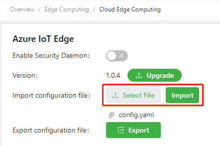

# Azure IoT Edge User Manual

Azure IoT Edge integrates cloud analysis and custom service logic into devices to help organizations focus on service insights instead of data management. It packages service logic into standard containers, scales out IoT solutions, deploys these containers to devices, and then monitors these devices on the cloud. For more information about Azure IoT Edge, see [About Azure IoT Edge module](https://docs.azure.cn/en-us/iot-edge/iot-edge-modules).   
The InHand IG902-series products provide Azure IoT Edge SDK to support Azure IoT Edge and enable you to quickly develop and complete tasks and securely and efficiently deploy services. This SDK manages the Azure IoT Edge runtime to manage the Azure cloud platform deployment and run the IoT Edge module (docker image) on the IoT Edge device (IG902).   
This document describes how to deploy and run an IoT Edge module that simulates telemetry data and sends it to IoT Hub on IG902 through the Azure platform by using the Azure IoT Edge SDK.

  - [1. Environment Preparations](#environmental-preparation)
    - [1.1 Configure the Azure IoT environment](#configure-azure-iot-environment)
    - [1.2 Configure the IG902 environment](#configure-ig902-environment)
      - [1.2.1 Configure IG902 to connect to the Internet](#configure-wan)
      - [1.2.2 Update the IG902 software version](#update-ig902-software-version)
    - [1.3 Modify the configuration file of Azure IoT Edge](#change-azure-iot-edge-configuration-file)
  - [2. Run Azure IoT Edge](#run-azure-iot-edge)
  - [3. Configure and Deploy the Module](#configure-and-deploy-modules)

## 1. Environment Preparations

You need to prepare the following items before start (as for how to get the IG902 software version, contact the customer services):

- Azure IoT account
- IG902 firmware version: v2.0.0.r12644 or later
- Docker SDK version: 18.06.3-ce or later
- Azure IoT Edge SDK version: 1.0.4 or later
- IG902-series products

### 1.1 Configure the Azure IoT environment

If you have deployed the corresponding IoT Hub and IoT Edge devices on Azure IoT, skip this section.

- Step 1: Log in to Azure IoT  
Visit <https://portal.azure.cn/> and log in to Azure.
  
  

- Step 2: Add IoT Hub  
After successful login, the page is as follows. Select **IoT Hub**.
  
  
  
  Click **Add** to create an IoT Hub.
  
  
  
  
  
  After the IoT Hub is created, the page is as follows:
  
  

- Step 3: Add an IoT Edge device  
On the **IoT Hub** page, click the target IoT Hub. On the **IoT Edge** that appears, click **Add an IoT Edge device**.
  
  
  
  Configure the parameters and click **Save**.
  
  

- Step 4: Copy the connection string of the IoT Edge device  
After the IoT Edge device is created, the page is as follows:
  
  
  
  Click **Device ID** of the IoT Edge device. On the details page of the IoT Edge device that appears, copy the **Primary Connection String** parameter for subsequent use.
  
  

### 1.2 Configure the IG902 environment

#### 1.2.1 Configure IG902 to connect to the Internet

As for how to configure IG902 to connect to the Internet, see [Connect IG902 to the Internet](http://manual.ig.inhandnetworks.com/en/latest/IG902-Quick-Start-Manual.html#set-wan-parameters-connect-ig902-to-the-internet).

#### 1.2.2 Update the IG902 software version

- Update the IG902 firmware version  
As for how to update the IG902 firmware version, see [Update the IG902 software version](http://manual.ig.inhandnetworks.com/en/latest/IG902-Quick-Start-Manual.html#update-the-software).

- Update the IG902 Docker SDK  
As for how to update the IG902 Docker SDK, see [Install Docker SDK.](http://docker.ig.inhandnetworks.com/en/latest/Docker-user-manual.html#install-docker-sdk-and-enable-docker-manager)

- Update the IG902 Azure IoT Edge SDK  
Choose **Edge Computing >> Cloud Edge Computing**, uncheck **Enable Security Daemon**, click **Upgrade**, select the Azure IoT Edge SDK file, and click **Confirm**.
  
  

### 1.3 Modify the configuration file of Azure IoT Edge

On the **Edge Computing >> Cloud Edge Computing** page, click **Export** to export the configuration file of Azure IoT Edge.

Modify the **device_connection_string** parameter in the configuration file of Azure IoT Edge and save the modification. This string is the **Primary Connection String** of the IoT Edge device that you copied in the step [Copy the connection string of the IoT Edge device](#copy-connection-string).

Import the modified configuration file of Azure IoT Edge.

## 2. Run Azure IoT Edge

Choose **Edge Computing >> Docker Manager** and check **Enable Docker Manager**.

Choose **Edge Computing >> Cloud Edge Computing**, and check **Enable Security Daemon**.

After the security daemon is enabled, the Azure IoT Edge daemon pulls an image to create a container named `edgeAgent`. This process takes for about 20 minutes because the image is large. You can choose **LOCAL >> Containers** on portainer to check whether the `edgeAgent` container is running. If the `edgeAgent` container is running, Azure IoT Edge is in normal operating state.

Then, **RUNTIME STATUS** of $edgeAgent on the details page of the IoT Edge device is `running`.

## 3. Configure and Deploy the Module

- Step 1: Add the IoT Edge module
  
  On the details page of the IoT Edge device, click **Set Modules**.
  
  
  
  On the **Set modules on device** page, click **Add** and select **IoT Edge Module** to add the IoT Edge module.
  
  
  
  In the window **Add IoT Edge Module** that appears, configure the module name and image URL. This document takes the `mcr.microsoft.com/azureiotedge-simulated-temperature-sensor:1.0` image as an example. This image, provided by Microsoft, simulates telemetry data and sends the data to IoT Hub. As for how to deploy the module, see [Develop and deploy the Python IoT Edge module for the Linux device](https://docs.microsoft.com/en-us/azure/iot-edge/tutorial-python-module).
  
  
  
  After the module is added, the page is as follows:
  
  
  
  The edgeHub container listens to the port 443 and is mapped to the port 443 of the host (IG902) by default. Generally, the IG902's port 443 is listened to and occupied by other programs. Therefore, you need to modify the mapping port of the edgeHub container to ensure that edgeHub can be started. Click **Runtime Setting**. In the window **Runtime Settings** that appears, modify **HostPort** to another port, such as `444`. After modification, click **Save**.
  
  
  
  Then, click **Review + create** and click **Create** after confirmation. The IoT Edge module is added.
  
  
  
  The `edgeHub` and `mcr.microsoft.com/azureiotedge-simulated-temperature-sensor:1.0` are automatically deployed to IG902 and run on IG902. You can view the deployed containers on the details page of the IoT Edge device. If **RUNTIME STATUS** is `running`, the container has been deployed and runs normally. (The total size of two images is about 400 MB. It takes about 20 or more minutes to deploy them.)
  
  

- Step 2: View the container running status
  
  Access portainer and choose **LOCAL >> Containers**. It can be seen that three containers are already running.
  
  
  
  Click **Logs** of the `EIP-demo-edge-module` container to view its running logs. If the logs are as follows, the container runs normally, that is, it simulates the telemetry data and sends the data to IoT Hub.
  
  
  
  

At this time, you have deployed and run an IoT Edge module that simulates telemetry data and sends it to IoT Hub on IG902 through the Azure platform.